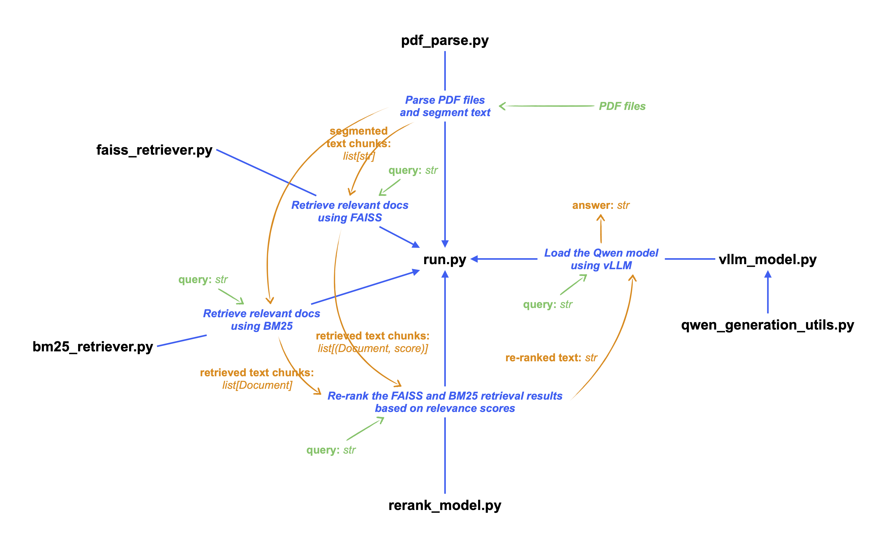

# Reproduction for [Tianchi-LLM-QA](https://github.com/dawoshi/Tianchi-LLM-QA?tab=readme-ov-file)

## **Environment setup**

**Check cuda version**

```
module avail 2>&1 | grep -i cuda
```

**Load cuda and gcc**

```
module load cuda/12.2.1
module load gcc
```

**Install dependencies**

```
pip install -r requirements.txt
```
---
## Get started

**Run run.sh**

```
sbatch run.sh
```

LLM-generated results are saved in './data/result.json'

**Evaluate the results**

```
sbatch test_score.sh
```

---

## Project Structure

```
├── requirements.txt
├── config.py
├── data
│   ├── result.json                # LLM-generated answers
│   ├── test_question.json         # test dataset
│   └── train_a.pdf                # pdf file to be parsed
├── pdf_parse.py                   # Parse PDF files and segment text following 3 methods.
├── faiss_retriever.py             # FAISS retriever
├── bm25_retriever.py              # BM25 retriever
├── rerank_model.py                # Rerank the retrieved docs based on relevance scores
├── vllm_model.py                  # vLLM acceleration
├── qwen_generation_utils.py       # Utility functions for Qwen
├── run.py                         # Main file
├── run.sh                         # Main script
├── test_score.py                  # Online evaluation
└── test_score.sh                  # Online evaluation script
```

<p align="center">
  
</p>